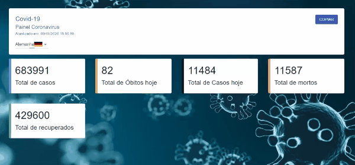

# Covid-19

This project is part of the [Digital Innovation One](https://digitalinnovation.one/) class and consists on a page that fetch information from an [API](https://coronavirus-19-api.herokuapp.com/countries) and displays it on cards.

We mainly use [React](https://reactjs.org), to handle the data from the API.

<br />
<p align="center">
    
</p>

# Guide

* [Features](#features)
* [Installation](#installation)
* [Technologies](#technologies)
* [Future Implementations](#future-implementations)


# Features

*  We have information about Covid 19 from some countries.

# Installation

**You will need install:**

 [Node.js](https://nodejs.org/en/download/) <br />
 [Yarn](https://classic.yarnpkg.com/en/) 

**Clone the repository**

`git clone https://github.com/cledman/typescript-covid19`

**Install dependencies**

```yarn ```


**Run the application:**

```yarn start```

# Technologies

* [React](https://reactjs.org)
* [TypeScript](https://www.typescriptlang.org/)

# Future Implementations

We could add some dynamic changes and options to select desired information.

##